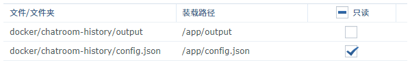

# 微信群名历史记录

本项目可记录微信群聊的群名，并且生成一个时间线静态页面部署到 Git 仓库中。配合 Github Pages 或 Netlify 一起食用更佳。

## Docker 部署

从Docker Hub拉取：

```shell
docker pull jonbgua/chatroom-name-history-weixin
```

按照如图挂载文件/文件夹（图为群晖的Docker GUI）：



在Docker容器中新建一个Bash会话，执行如下命令：

```shell
git config --global user.name "NAME"
git config --global user.email "EMAIL"
ssh-keygen
cat /root/.ssh/id_rsa.pub
```

然后还得输一个信任Git证书的'yes'。

注：Git仓库地址需要用SSH协议的。

## TO-DO

- [ ] 向机器人说'status'可以得到系统运行状态的反馈
- [ ] 进一步模块化

## 参考资料

毕竟Copy & Paste From Google/面向搜索引擎编程…（逃

### 页面模板

[65 CSS Timelines](https://freefrontend.com/css-timelines/)

### 静态页面生成

[A minimal example generating HTML with Python Jinja](https://code-maven.com/minimal-example-generating-html-with-python-jinja)

### Git 提交

[Tutorial - GitPython](https://gitpython.readthedocs.io/en/stable/tutorial.html)

[How to push to remote repo with GitPython - StackOverflow](https://stackoverflow.com/questions/41429525/how-to-push-to-remote-repo-with-gitpython)
